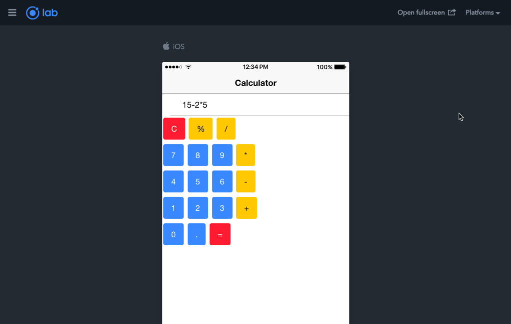
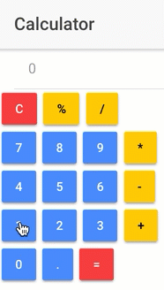

## Ionic3_2ndTutorial

How to create a calculator application with Ionic framework 3 by using Ionic Creator for UI

The step by step tutorial is published and you can, of course, check it out for free: [How to create a calculator application with Ionic framework 3 by using Ionic Creator for UI](http://www.nikola-breznjak.com/blog/javascript/ionic3/create-calculator-application-ionic-framework-3-using-ionic-creator-ui/).

### How to use this code
+ make sure you have Ionic installed. For instructions on how to, please check out the first tutorial in this series: [How to get started with Ionic framework 3 on Mac and Windows](http://www.nikola-breznjak.com/blog/javascript/ionic3/get-started-ionic-framework-3-mac-windows/)
+ clone the code from this repo
+ in the project directory execute `ionic lab` to run the project locally in your browser

### Demo
You can check out the live example of this application [here](http://hitman666.github.io/Ionic3_2ndTutorial/).

Here's a gif of how it looks/works:

